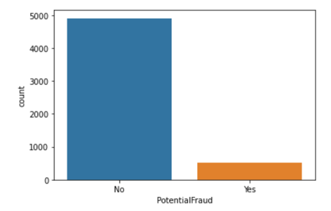
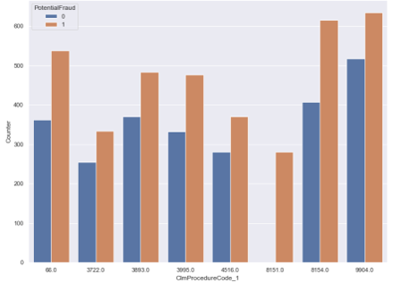
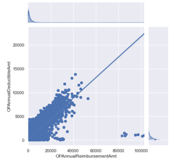
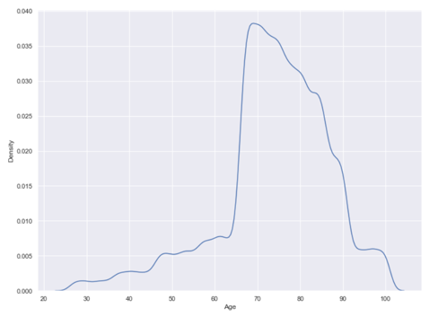

# Healthcare Insurance Provider Fraud Detection
Materials: [Presentation](https://drive.google.com/drive/folders/1u4yLQPkfKcuXrW601tP3sW95Q4vACmJR?usp=sharing) 
 
This project was created as a solution to the Krunchh Analytics Event conducted by the Department of Management Studies, IIT Madras.
 
It was inspired by the real-life problem faced in the healthcare insurance industry i.e., Provider Fraud that causes a substantial increase in Medicare 
spending due to fraudulent claims, involving collaboration among providers, physicians, and beneficiaries. Rigorous data analysis has identified physicians 
engaging in fraud, often using ambiguous diagnosis codes to justify costly procedures and drugs, impacting insurance companies and leading to rising healthcare 
costs. Common forms of healthcare fraud by providers include billing for services not rendered, submitting duplicate claims, misrepresenting services, 
overcharging for more complex procedures, and billing for uncovered services.
 

 
Firstly some EDA was done wherein I figured out some insights about the dataset, its imbalance nature, top states, and races with claims.
 

 
Secondly, some important analyses led to finding the involvement of doctors themselves in the fraud.
 

 
Then, code-wise claiming fraud wherein certain insurance codes had much larger fraud associated with it than the others.
 

 
Age and Amount analysis gave a complete insight into the given dataset.
 
After this, feature engineering and selection were performed to extract the important and novel features of this dataset based on their importance value. 
The feature extraction involved creating multiple new features like Age, Number of days in hospital, total amount lost by the insurance firm, etc.
 
To mitigate the impact of imbalances in the dataset; Oversampling takes place using SMOTE (Synthetic Minority Over-sampling Technique) which randomly 
selects neighbors and interpolates between them to create new samples.
 

 
The top performance is provided by the Extreme Gradient Boost (XGBoost) classifier is the model with maximum performance and optimal time followed by 
Gradient Boost Classifier. As a result, we can see that oversampling at the start to make the training balanced along with XGBoost Classifier gives a 
complete performance on the training set and a high performance on the test set.
 

 
More improvements in classification can be done after understanding better properties of the dataset and using them for predictive modeling. 
Multiple steps in the pipeline can be ablated for improvement in results. Also, powerful neural networks can be used for the same. My team ranked within the 
top 5 teams across all the participating teams nationally.
 
